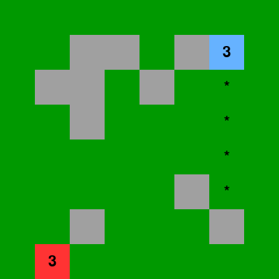
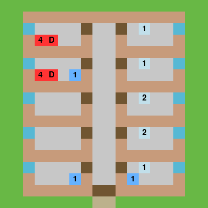

# SimpleRL

A series of environments for training reinforcement learning agents. The environments are designed to be simple to use, quick to execute and rely on few external libraries.

## Contents 

The following environments have currently been implemented:

### Laser Tag



**File**: ```laser_tag.py```

**Description**: A turn-based grid environment in which a selected agent competes against an enemy in the game of laser tag with the end goal to reduce the opposing player's lives to zero. 
* State -  a flattened version of the grid environment with the positions of both players and the terrain.
* Action - a player movement in a given direction followed by a shot in another specified direction.
* Reward - given for every successful hit on the opponent.

### Hospital



**File**: ```hospital.py```

**Description**: A basic simulator of hospital management in which a selected agent must manage hospital staff to treat as many patients as possible in the allotted period.
* State -  the severity, days waiting and type of assistance required for each room with a patient in. 
* Action - the room assignments of each staff member (doctors and nurses).
* Reward - penalty is given when patients die or when they a left waiting for long periods.

### Race Car


**File**: ```race_car.py``` 

**Description**: A simple racing game in which a selected agent must steer a car around a track without hitting the edges.
* State -  the distance of the cars front facing sensors to the perimeter, the current speed and the steering angle. 
* Action - brake, steer left or steer right.
* Reward - greater reward is given the closer the car is to its next checkpoint.


## Installation

It is recommended to install the library using pip, preferrably within a virtual environment to avoid dependency conflicts. 

```
pip install SimpleRL
```

## Usage

Environments are deployed in a very similar way to OpenAI Gym environments (https://github.com/openai/gym). Here is an example of the "laser_tag" environment being used with random agent:

```python
from SimpleRL.envs import laser_tag_env

# Import the environment
env = laser_tag_env(render=True)

state, done = env.reset(), False
while not done:
    
    # take an action and update the environment
    action = env.sample_discrete_action()
    state, reward, done, info = env.step(action=action)
```

Details describing the state and actions of the individual environments can be found within their corresponding files. This is in addition to information describing the input parameters for the environment. 

## Licence
[MIT](https://choosealicense.com/licenses/mit/)


